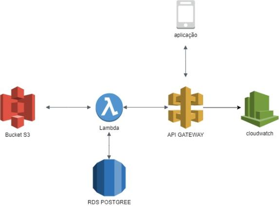

Credit card point manager
===================================

Application to manage points in credit cards

Requirements
------------
* Java 11
* Maven

Quick start
-----------
1. Run command: `mvn clean install`
2. Run application: `java -jar target/creditCardPointManager-0.0.1-SNAPSHOT.jar`
3. Point your browser to [http://localhost:8080](http://localhost:8080/)

Architecture
----------

